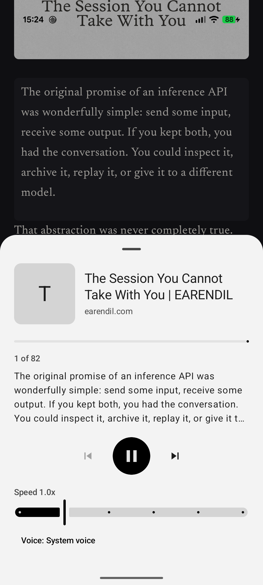
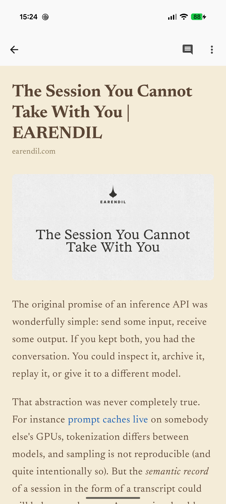
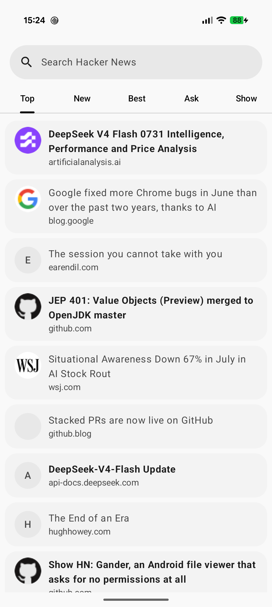

# Kiosk

A Hacker News reader for Android.

## Install

Release APKs are available from [GitHub Releases](https://github.com/shapeshed/kiosk/releases).

## Screenshots

  
  
  

## Features

- Browse Top, New, Best, Ask, Show, and Jobs.
- Search historical Hacker News stories.
- Read articles in a native, distraction-free reader.
- Swipe between stories, open comments quickly, and keep read/unread state.
- Use reader themes, fonts, Speed Reader, Read Aloud, and zoomable article images.
- Open PDFs, X/Twitter, YouTube, and external links in the default app or browser.

## Development

Developer documentation lives in [DEVELOPERS.md](DEVELOPERS.md). See
[CONTRIBUTING.md](.github/CONTRIBUTING.md) for how to propose changes, and
[SECURITY.md](.github/SECURITY.md) to report a vulnerability privately.

## Privacy

Kiosk does not include advertising, analytics, tracking SDKs, Firebase, Crashlytics, Google Play
Services, or user accounts. See [PRIVACY.md](PRIVACY.md) for details.

## License

Kiosk is licensed under the Apache License, Version 2.0. See [LICENSE](LICENSE).
